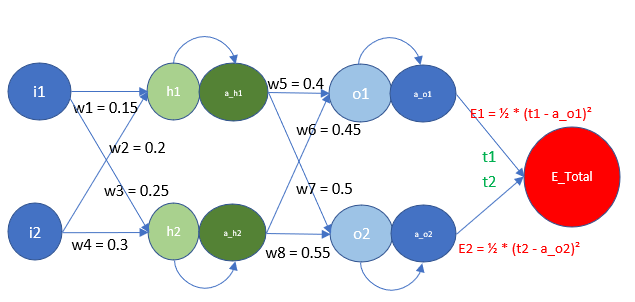
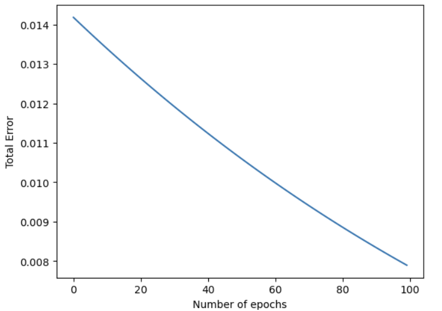
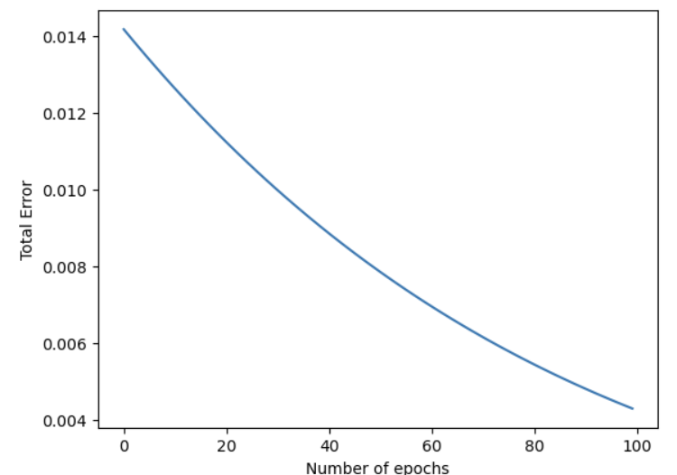
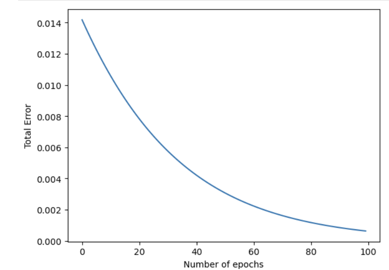
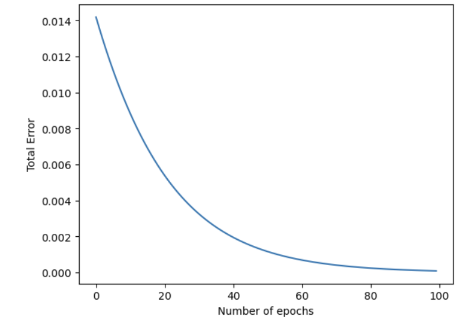
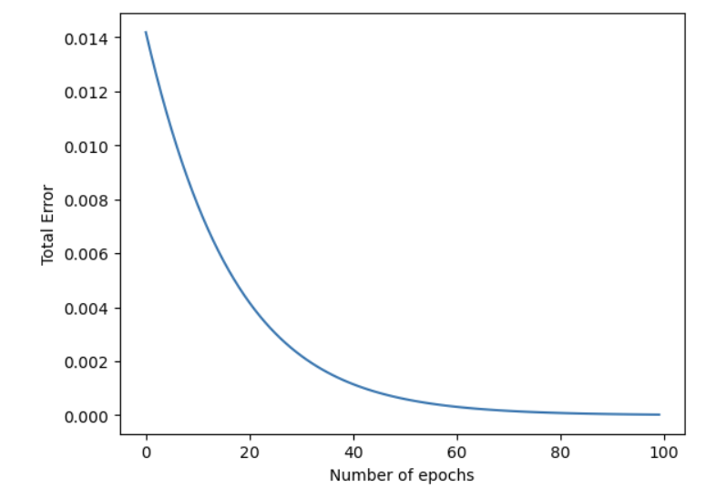
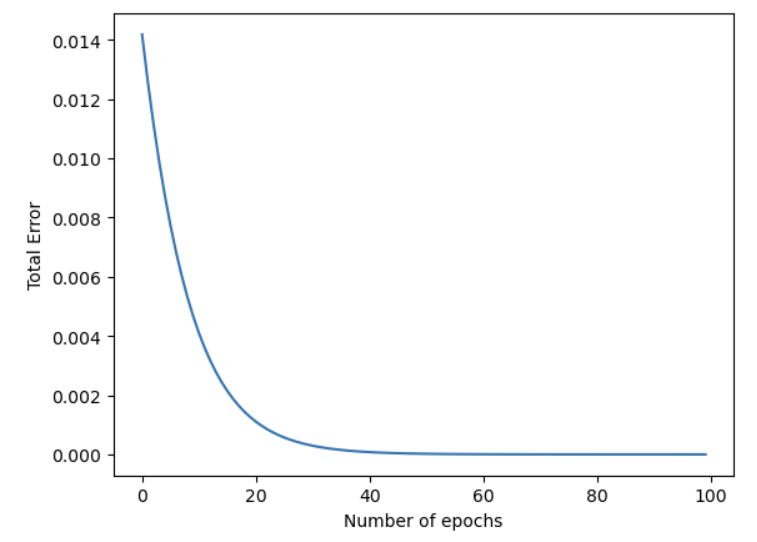

# Back propogation in Neural Networks
## Introduction
Backpropagation is a popular method for training artificial neural networks, especially deep neural networks.

Backpropagation is needed to calculate the gradient, which we need to adapt the weights of the weight matrices. The weights of the neurons (ie nodes) of the neural network are adjusted by calculating the gradient of the loss function. For this purpose a gradient descent optimization algorithm is used. It is also called backward propagation of errors.

Picture yourself being put in a mountain, not necessarily at the top, by a helicopter at night and/or under fog. Let’s also imagine that this mountain is on an island and you want to reach sea level.

- You have to go down, but you hardly see anything, maybe just a few meters. Your task is to find your way down, but you cannot see the path. You can use the method of gradient descent. This means that you are examining the steepness at your current position. You will proceed in the direction with the steepest descent.
- You take only a few steps and then you stop again to reorientate yourself. This means you are applying again the previously described procedure, i.e. you are looking for the steepest descend.

    

Keeping going like this will enable you to arrive at a position where there is no further descend (ie each direction goes upwards). You may have reached the deepest level (global minimum), but you could be stuck in a basin or something. If you start at the position on the right side of our image, everything works out fine, but from the left-side, you will be stuck in a local minimum.

In summary, if you are dropped many times at random places on this theoretical island, you will find ways downwards to sea level. This is what we actually do when we train a neural network.

## Tutorial
We shall walkthrough a simple example of how back propogation works in a simple neural network having 1 hidden layer as shown below. 



- The input layer, $i_1$ and $i_2$ are connected to one hidden layer $h_1$ and $h_2$. 
- The neuron $h_1$, is connected to both inputs by the weights $w_1$ ($i_1$) and $w_2$ ($i_2$).
- The neuron $h_2$, is connected to both inputs by the weights $w_3$ ($i_1$) and $w_4$ ($i_2$).
- The hidden layer is connected to the the outputs $o_1$ and $o_2$ after an activation function is applied to it denoted by $a\_h_1$ and $a\_h_2$ as shown in the figure.
- The output neuron $o_1$ is conencted to $a\_h_1$ ($w_5$) and $a\_h_2$ ($w_6$).
- Similarly, the output neuron $o_2$ is conencted to $a\_h_1$ ($w_7$) and $a\_h_2$ ($w_8$).
- The error is calculated as $E_{total}$ which is the sum of $E_1$ and $E_2$. 
- To keep our calculations simple we are using $1/2*(target - output)^2$
- $t_1$ and $t_2$ are thr respective targets related to $o_1$ and $o_2$.

We can summarise the above diagram as

- $h_1$ = $w_1$*$i_1$ + $w_2$*$i_2$		

- $h_2$ = $w_3$*$i_1$ + $w_4$*$i_2$		

- $a\_h_1$ = σ($h_1$) = 1/(1 + exp(-$h_1$))		

- $a\_h_2$ = σ($h_2$)		

- $o_1$ = $w_5$*$a\_h_1$ + $w6$*$a\_h_2$		

- $o_2$ = $w_7$*$a\_h_1$ + $w_8$*$a\_h_2$		

- $a\_o_1$ = σ($o_1$)		

- $a\_o_2$ = σ($o_2$)		

- $E_{total}$ = $E_1$ + $E_2$		

- $E_1$ = ½ * ($t_1$ - $a\_o_1$)²		

- $E_2$ = ½ * ($t_2$ - $a\_o_2$)²	

where σ is the activation function	

*Note: The derivative of the sigmoid function σ(x) is the sigmoid function σ(x) multiplied by 1−σ(x)*

### Hidden weights ($w_5,w_6,w_7$ and $w_8$)
For back propogation, we need to understand how the targets are related to each of the weights so that we calculate the gradients that needs to applied. Consider the exampple of the weight $w_5$. 
- The gradient of the total error with respect to $w_5$ can be denoted as $∂E_{total}/∂w_5 = ∂E_1/∂w_5$ (since $w_5$ has no relation to E2, $∂E_2/∂w_5$ will be 0).
- The above equation can be re-written using the chain rule of derivatives as $∂E_{total}/∂w_5 = ∂E_1/∂w_5 = ∂E_1/∂a\_o_1*∂a\_o_1/∂o_1*∂o_1/∂w_5$.
- The above equation can be re-written as:
    - $∂E_1/∂a\_o_1 =  ∂(½ * (t_1 - a\_o_1)²)/∂a\_o_1 = (a\_o_1 - t_1)$
    - $∂a\_o_1/∂o_1 =  ∂(σ(o_1))/∂o_1 = a\_o_1 * (1 - a\_o_1)$
    - $∂o_1/∂w_5 = a\_h_1$					
- Bringing all three components together we get, 
    
    $∂E_{total}/∂w_5 = (a\_0_1 - t_1) * a\_o_1 * (1 - a\_o_1) *  a\_h_1$
- Similary w6, w7, and w8 can be derived as 

    $
    ∂E_{total}/∂w_6 = (a\_o_1 - t_1) * a\_o_1 * (1 - a\_o_1) *  a\_h_2
    $
$
∂E_{total}/∂w_7 = (a\_o_2 - t_2) * a\_o_2 * (1 - a\_o_2) *  a\_h_1
$
$
∂E_{total}/∂w_8 = (a\_o_2 - t_2) * a\_o_2 * (1 - a\_o_2) *  a\_h_2    
$
- We have found the gradients required for back propogation of the weights $w_5, w_6, w_7$ and $w_8$.

### Input layer weights $(w_1, w_2, w_3$ and $w_4$)

Similariy we need to find the gradients for the weights of the input layers. Let us consider the case of weight w1. For the gradients of $w_1$ we need to first find the gradients of $a\_h_1$ with respect to the error.

- The gradient of the total error with respect to a_h1 can be denoted as $∂E_{total}/∂a_h1 = ∂E_1/∂a\_h1 + ∂E_1/∂a\_h2$ 
- Similar to the gradient descent of the hidden layer, we can derive $∂E_{total}/∂a\_h_1 = ∂E_1/∂a\_h_1 = ∂E_1/∂a\_o_1*∂a\_o_1/∂o_1*∂o_1/∂a\_h_1$.
- The above equation can be re-written as:
    - $∂E_1/∂a\_o_1 =  ∂(½ * (t_1 - a\_o_1)²)/∂a\_o_1 = (a\_o_1 - t_1)$
    - $∂a\_o_1/∂o_1 =  ∂(σ(o_1))/∂o_1 = a\_o_1 * (1 - a\_o_1)$
    - $∂o_1/∂a\_h_1 = w_5$
-  Combining the three equations we get 
    
    $∂E_1/∂a\_h_1 = (a\_o_1 - t_1) * a\_o_1 * (1 - a\_o_1) * w_5$	
- Similary $∂E_2/∂a\_h_1 = (a\_0_2 - t_2) * a\_o_2 * (1 - a\_o_2) * w_7$
- So the equation $∂E_{total}/∂a\_h_1 = ∂E_1/∂a\_h_1 + ∂E_1/∂a\_h_2$ becomes: 

    $
        ∂E_{total}/∂a\_h_1 = (a\_o_1 - t_1) * a\_o_1 * (1 - a\_o_1) * w_5 +  (a\_o_2 - t_2) * a\_o_2 * (1 - a\_o_2) * w_7
    $
- Similary the gradients for the error with respect to a_h2 becomes 

    $
        ∂E_{total}/∂a\_h_2 = (a\_o_1 - t_1) * a\_o_1 * (1 - a\_o_1) * w_6 +  (a\_o_2 - t_2) * a\_o_2 * (1 - a\_o_2) * w_8
    $
- To find the gradients for the weight w1, we can apply the chain rule again

    $
        ∂E_{total}/∂w_1 = ∂E_{total}/∂a\_h_1 * ∂a\_h_1/∂h_1 * ∂h_1/∂w_1
    $
- This results in combining all the above into one single equations as 

    -    $
    ∂E_{total}/∂w_1 = ((a\_o_1 - t_1) * a\_o_1 * (1 - a\_o_1) * w_5 +  (a\_o_2 - t_2) * a\_o_2 * (1 - a\_o_2) * w_7) * a\_h_1 * (1 - a\_h_1) * i_1
    $

    - $
    ∂E_{total}/∂w_2 = ((a\_o_1 - t_1) * a\_o_1 * (1 - a\_o_1) * w_5 +  (a\_o_2 - t_2) * a\_o_2 * (1 - a\_o_2) * w_7) * a\_h_1 * (1 - a\_h_1) * i_2
    $
    

    - $∂E_{total}/∂w_3 = ((a\_o_1 - t_1) * a\_o_1 * (1 - a\_o_1) * w_6 +  (a\_o_2 - t_2) * a\_o_2 * (1 - a\_o_2) * w_8) * a\_h_2 * (1 - a\_h_2) * i_1
    $
    
    - $∂E_{total}/∂w_4 = ((a\_o_1 - t_1) * a\_o_1 * (1 - a\_o_1) * w_6 +  (a\_o_2 - t_2) * a\_o_2 * (1 - a\_o_2) * w_8) * a\_h_2 * (1 - a\_h_2) * i_2
$

We have now found the equations using which we can back propogate and adjust the weights. The python notebook attached with this folder will programmatically do it. Based on the learning rate we configure it with, the weights after each pass will be adjusted as 
```
new_weight = old_weight - (learning rate x weight's gradient)
```
## [Python Notebook](./Back Propogation.ipynb)
- The code implements the backpropagation algorithm for training a neural network.
- The algorithm works by iteratively adjusting the weights of the network in order to minimize the error between the network's outputs and the desired outputs.
- The code first initializes the weights of the network randomly.
- Then, for a specified number of epochs, the code:
    - Performs a forward pass through the network, calculating the outputs of each neuron.
        ```python
        h1 = i1*w1 + i2*w2 
        a_h1 = 1/(1+math.exp(-1*h1))
        h2 = i1*w3 + i2*w4
        a_h2 = 1/(1+math.exp(-1*h2))
        o1 = w5*a_h1 + w6*a_h2
        a_o1 = 1/(1+math.exp(-1*o1))
        o2 = w7*a_h1 + w8*a_h2
        a_o2 = 1/(1+math.exp(-1*o2))
        ```
    - Calculates the error at each output neuron.

        ```python
        E1 = 0.5 * (t1 - a_o1)**2
        E2 = 0.5 * (t2 - a_o2)**2
        E_tot = E1 + E2
        ```
    - Performs a backward pass through the network, propagating the error back to the hidden layers.
        ```python
        dw1 = ((a_o1 - t1) * a_o1 * (1 - a_o1) * w5 +  (a_o2 - t2) * a_o2 * (1 - a_o2) * w7) * a_h1 * (1 - a_h1) * i1
        dw2 = ((a_o1 - t1) * a_o1 * (1 - a_o1) * w5 +  (a_o2 - t2) * a_o2 * (1 - a_o2) * w7) * a_h1 * (1 - a_h1) * i2
        dw3 = ((a_o1 - t1) * a_o1 * (1 - a_o1) * w6 +  (a_o2 - t2) * a_o2 * (1 - a_o2) * w8) * a_h2 * (1 - a_h2) * i1
        dw4 = ((a_o1 - t1) * a_o1 * (1 - a_o1) * w6 +  (a_o2 - t2) * a_o2 * (1 - a_o2) * w8) * a_h2 * (1 - a_h2) * i2
        dw5 = (a_o1 - t1) * a_o1 * (1 - a_o1) *  a_h1
        dw6 = (a_o1 - t1) * a_o1 * (1 - a_o1) *  a_h2
        dw7 = (a_o2 - t2) * a_o2 * (1 - a_o2) *  a_h1
        dw8 = (a_o2 - t2) * a_o2 * (1 - a_o2) *  a_h2
        ```
    - Updates the weights of the network, using the error and the learning rate.
        ```python
        w1 = w1 - (learning_rate*dw1)
        w2 = w2 - (learning_rate*dw2)
        w3 = w3 - (learning_rate*dw3)
        w4 = w4 - (learning_rate*dw4)
        w5 = w5 - (learning_rate*dw5)
        w6 = w6 - (learning_rate*dw6)
        w7 = w7 - (learning_rate*dw7)
        w8 = w8 - (learning_rate*dw8)
        ```
- After the specified number of epochs, the code terminates.

The code above is a simplified version of the backpropagation algorithm. In practice, there are a number of additional steps that can be taken to improve the performance of the algorithm, such as using momentum and regularization.

## Effect of Learning rate

Now we'll see the effect of learning rate on the weights.
We shall consider different learning rates of  [0.1, 0.2, 0.5, 0.8, 1.0, 2.0]  while keeping all the other parameters such as input, target, initial weights etc. constant.

- For a learning rate of 0.1, we see the error decreases linearly with the number of iterations as shown below.
    
      
    
- Similary for a learning rate of 0.2, we see somewhat the same.
    
      

- Similary for a learning rate of 0.5, we see somewhat the same but with more of a exponential curve rather than a linear one.
    
      

- For a learning rate of 0.8, the exponential curve becomes more evident.
    
      

- For a learning rate of 1.0, the exponential curve results in the error nearing 0 before the total number of iterations we run it for.
    
      

- For a learning rate of 2.0, the error is almost close to 0 after about 25 iterations. For a learning rate of 1, this was achieved in in about 60 iterations and for learning rate of 0.8 it was achieved after about 80 iterations.
    
      

We can see that as the learning rate increases, the faster the error nears zero since the rate at which it changes with each iteration becomes more exponential rather than linear. A high learning rate means that the weights change quickly, which can lead to faster convergence or overshooting the optimal point.


## References
- [Back propogation - Medium](https://medium.com/@jorgesleonel/backpropagation-cc81e9c772fd)


 

					
					
					


